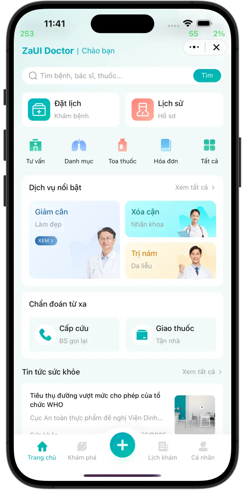
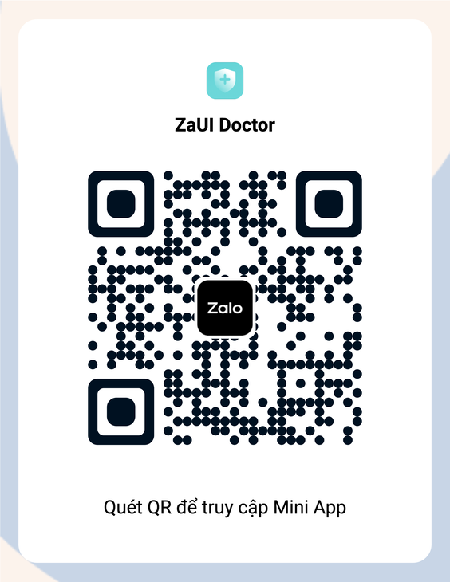
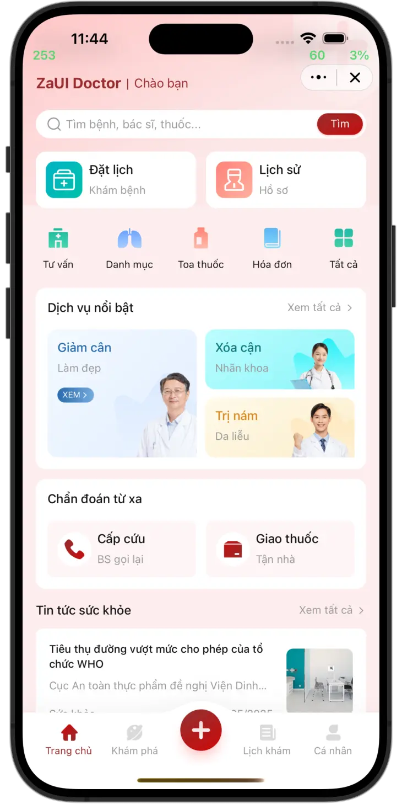
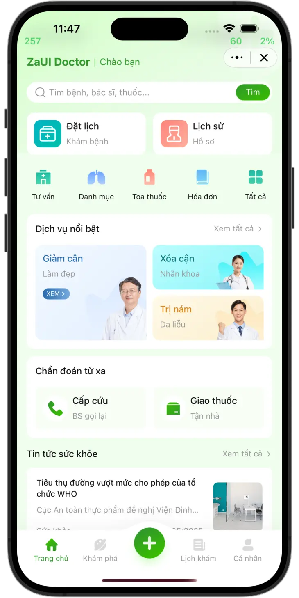
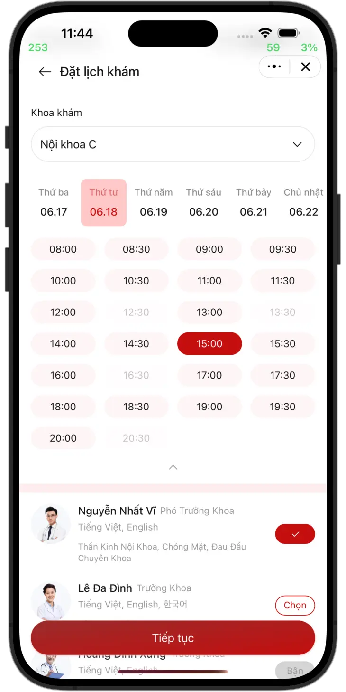
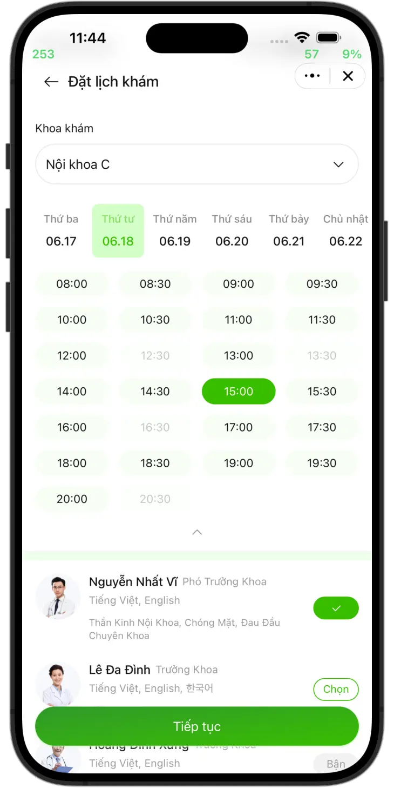

# ZaUI Doctor

<p style="display: flex; flex-wrap: wrap; gap: 4px">
  
  
  
  
  
  
</p>

A Zalo Mini App template perfect for hospitals, clinics, and healthcare providers looking to digitize their services.

|                      Demo                       |                  Entrypoint                  |
| :---------------------------------------------: | :------------------------------------------: |
|  |  |

## Features

- 3 forms: Booking form, Ask a question form, and Feedback form with support for multi-image upload.
- Search functionality for doctors, departments, and news
- List of services, departments, and news
- Schedule and invoice management
- Chat with Zalo OA
- Profile page

## Setup

### Using Zalo Mini App Extension

1. Install [Visual Studio Code](https://code.visualstudio.com/download) and [Zalo Mini App Extension](https://mini.zalo.me/docs/dev-tools).
1. Click on **Create Project** > Choose **ZaUI Doctor** template > Wait until the generated project is ready.
1. **Configure App ID** and **Install Dependencies**, then navigate to the **Run** panel > **Start** to develop your Mini App 🚀

### Using Zalo Mini App CLI

> **Note:** Vite 5 compatibility in CLI is under development. Until then, please use the Zalo Mini App Extension.

1. [Install Node JS](https://nodejs.org/en/download/).
1. [Install Zalo Mini App CLI](https://mini.zalo.me/docs/dev-tools/cli/intro/).
1. **Download** or **clone** this repository.
1. **Install dependencies**:
   ```bash
   npm install
   ```
1. **Start** the dev server using `zmp-cli`:
   ```bash
   zmp start
   ```
1. **Open** `localhost:3000` in your browser and start coding 🔥

### Using Zalo Mini App Studio

This template is built using **Vite 5.x**, which is **not compatible** with Zalo Mini App Studio.

## Deployment

1. **Create** a Zalo Mini App ID. For instructions, please refer to the [Coffee Shop Tutorial](https://mini.zalo.me/tutorial/coffee-shop/step-1/).

1. **Deploy** your mini program to Zalo using the ID created.

   If you're using Zalo Mini App Extension: navigate to the Deploy panel > Login > Deploy.

   If you're using `zmp-cli`:

   ```bash
   zmp login
   zmp deploy
   ```

1. Scan the **QR code** using Zalo to preview your mini program.

## Usage

The repository contains sample UI components and features for building your healthcare application. You may modify the code to suit your specific healthcare needs.

Here are some recipes and instructions on how to customize the application.

### Register a new page

To register a new page:

1. Create a new folder in `src/pages/`.
2. Create an `index.tsx` file containing a `*Page` component.
3. Register the page in `src/router.tsx`:

   ```tsx
   {
      path: "/payment-result",
      element: <PaymentResultPage />,
      handle: {
         back: true, // If the page has a back button
         title: "Giao dịch hoàn tất", // The title to be shown on the header
      },
   }
   ```

4. Sections of a page can be split into components in the same folder. For example: `src/pages/payment-result/tab1.tsx`, `src/pages/payment-result/tab2.tsx`,...

### Load data from your server

Data are loaded into view using Jotai's state, called [atoms](https://jotai.org/docs/core/atom). You can change how data are loaded without changing the UI by replacing `src/state.ts`:

```diff
- export const doctorsState = atom<Promise<Doctor[]>>(mockDoctors);
+ export const doctorsState = atom<Promise<Doctor[]>>(async () => {
+   const response = await fetch("https://");
+   return response.json();
+ });
```

As long as the new data satisfies the given TypeScript interface (for example, `Doctor`), no changes to the UI are required. Otherwise, feel free to refactor the interfaces and the UI to suit your DTO.

### Handle form submission

Modify the `onSubmit` logic in the form you want to handle submission. For example:

```diff tsx filename="src/pages/booking/step2.tsx"
onSubmit={async () => {
-   await wait(1500);
-   promptJSON(formData);
+   const response = await fetch("https://", {
+      method: "POST",
+      headers: {
+      "Content-Type": "application/json",
+      },
+      body: JSON.stringify(formData),
+   });
   navigate("/booking/3", {
      viewTransition: true,
   });
}}
```

### Change header title

Modify `app-config.json` > `app.title` field.

```json
{
   "app": {
      "title": "ZaUI Doctor",
```

### Change OA ID

There is a CTA block to chat with Zalo OA. To change the Zalo OA for chat, modify `app-config.json` > `template.oaID` field:

```json
{
   "template": {
      "name": "zaui-doctor",
      "oaID": "4318657068771012646"
```

### Customization

This template can be customized by changing 5 main colors in `src/css/app.scss`:

```css
:root {
  --primary: #00abbb;
  --primary-gradient: #00bead;
  --highlight: #01bdaf1a;
  --background: #f2f9f9;
  --disabled: #9a9a9a;
```

| `--primary: #31992c`                      | `--primary: #992c2c`                          |
| ----------------------------------------- | --------------------------------------------- |
|          |          |
|  |  |
